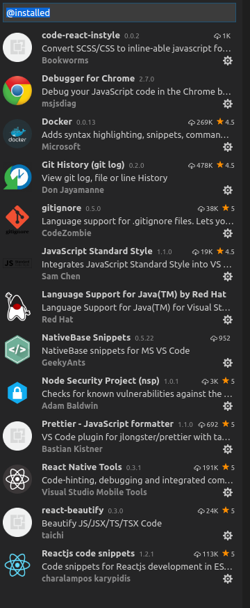

# toolset for Ubuntu -
```shell
sudo apt-get update
sudo apt-get install build-essential checkinstall libssl-dev
```
# Install NVM - for node
```shell
curl -o- https://raw.githubusercontent.com/creationix/nvm/v0.32.1/install.sh | bash
```
## Check which version you can install 
```shell
 nvm ls-remote
 nvm install 7.7.2 #for example
```
## Make sure latest version of npm installed
```shell
 npm install npm@latest -g
```
# git 

## Install Git
```shell
 npm install git -g
```
## Install dotEnv for sensitive connection information saved in .env files
```shell
 npm install dotenv -g
```
## Install Standard for linting 
```shell
npm install standard -g 
```
### Run standard on your code - it can also be installed as an extension to code-insiders
```shell 
standard --fix 
```

# TODO
## Virtual Box img - with setup done
* All you need then is the image and Virtual box installed
 

# Code
NodeJS (advantages unit test, linting, security, enforced coding standards)
* Python
* JS
* R 


# Databases
* Mongo (for json / read data)
* Firebase (realtime)
* Postgres (for spatial data / higher performance)

# HTML
* Handlebars 
* SASS
* React
* Angular 
* Insert Favourite Framework here!


# IDE 
*Visual Studio Code Insiders
```shell
curl https://packages.microsoft.com/keys/microsoft.asc | gpg --dearmor > microsoft.gpg
sudo mv microsoft.gpg /etc/apt/trusted.gpg.d/microsoft.gpg
sudo sh -c 'echo "deb [arch=amd64] http://packages.microsoft.com/repos/vscode stable main" > /etc/apt/sources.list.d/vscode.list'
sudo apt-get update
sudo apt-get install code-insiders
sudo update-alternatives --set editor /usr/bin/code-insiders
code-insiders . 
```
## For Extensions to see what you have installed
```command
ctrl-shift-p ext @installed 
```


for debuging in code-insiders copy this into .vscode/launch.json where 3000 is your port and you are debugging on localhost

```json
{
    // Use IntelliSense to learn about possible Node.js debug attributes.
    // Hover to view descriptions of existing attributes.
    // For more information, visit: https://go.microsoft.com/fwlink/?linkid=830387
    "version": "0.2.0",
    "configurations": [
    {
             "name": "Debug",
                "type": "chrome",
                "request": "launch",
                "webRoot": "${workspaceRoot}",
                "url": "http://localhost:3000", 
                "userDataDir": "${workspaceRoot}/.vscode/chrome",
                "sourceMaps": true,
                "preLaunchTask": "development",
                "smartStep": true,
                "internalConsoleOptions": "openOnSessionStart",
                "skipFiles": [
                    "${workspaceRoot}/node_modules/**/*.js",
                    "${workspaceRoot}/lib/**/*.js"
                ],
    "sourceMapPathOverrides": {
        "/source/*": "${workspaceRoot}/*",
        "webpack:///./*":   "${webRoot}/*",                    // Example: "webpack:///./src/app.js" -> "/users/me/project/src/app.js",
        "webpack:///./~/*": "${workspaceRoot}/node_modules/*", // Example: "webpack:///./~/querystring/index.js" -> "/Users/me/project/node_modules/querystring/index.js"
        "webpack:///*":     "*",                               // Example: "webpack:///C:/project/app.ts" -> "C:/project/app.ts"
        "meteor://💻app/*": "${webRoot}/*"                    // Example: "meteor://💻app/main.ts" -> "c:/code/main.ts"
    }   
    }
    ]
}

```
## Then to Open your project when in relevant directory


* brackets.io
* sublime
* insert favourite text editor here

# Debug
```shell
node --inspect --debug-brk filename.js
```

https://developer.chrome.com/devtools/docs/debugger-protocol
[https://code.visualstudio.com/blogs/2016/02/23/introducing-chrome-debugger-for-vs-code](Add chrome as external debugger)
https://chrome.google.com/webstore/detail/nim-node-inspector-manage/gnhhdgbaldcilmgcpfddgdbkhjohddkj
(NIM)
https://github.com/yury-s/v8-inspector

# Testing
Travis - https://travis-ci.org/ with travis.yml file defining the automatic test and deploy


# Translation i18n
## https://www.transifex.com/
```script 
sudo apt install transifex-client
```
### Login and register and copy setting to ~/.transifexrc
#### tx pull
#### tx push

# Communication
* Trello outdated - move to github
* use email
* slack bot 
* email address per project

# React 
If using react can follow the following guideline to get running quickly

https://react-server.io/docs
```script

# install yeoman
npm install -g yo

# install the react-server generator
npm install -g generator-react-server

# make a new react-server project in the CURRENT directory
yo react-server

# run the new app
npm run start

# go to http://localhost:3000
```


